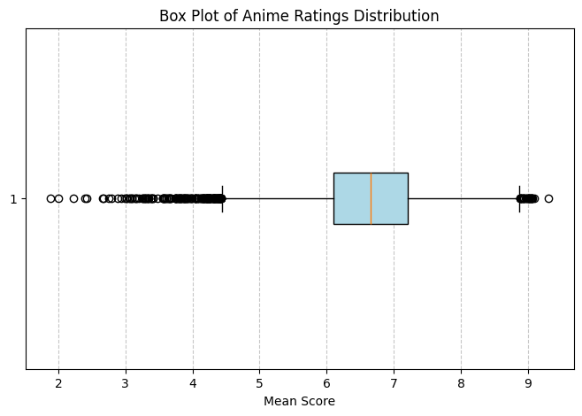
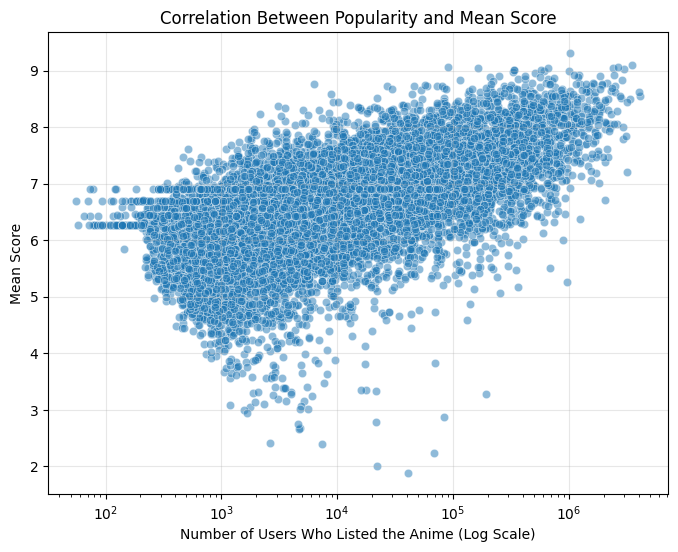
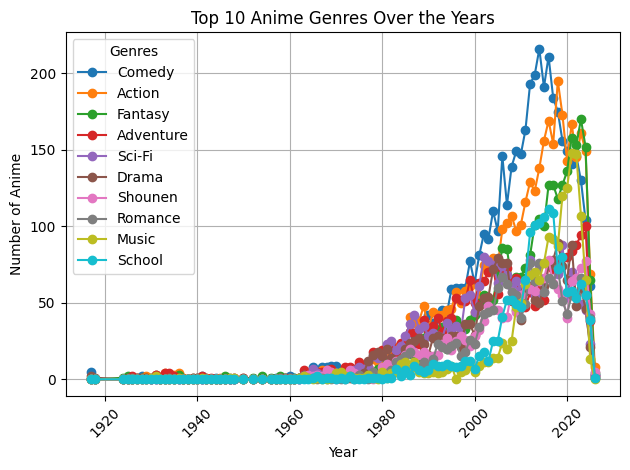
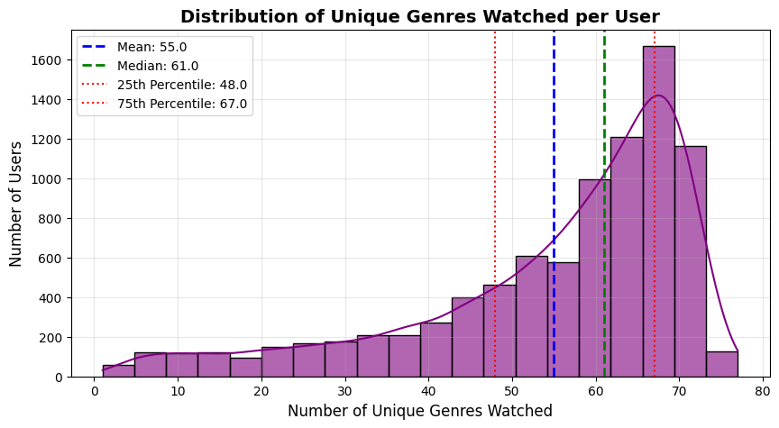
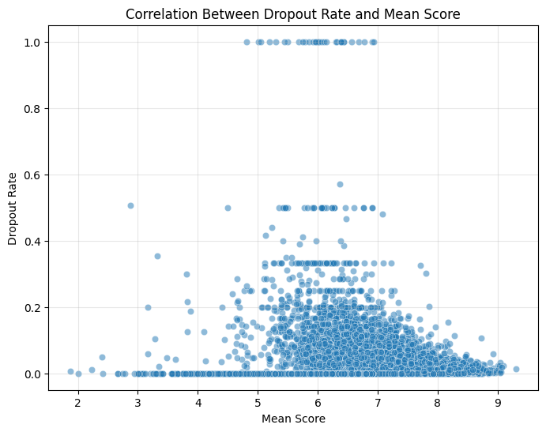

# 📊 Anime Exploratory Data Analysis (EDA)

This folder contains the core exploratory data analysis for the anime dataset, revealing trends in ratings, genres, studios, user behaviors, and the evolution of anime over time.

---

## **Project Overview**

- **Data:** >13,000 anime records, >2.2 million user-anime interactions scraped from MyAnimeList.
- **Goal:** Clean, explore, and visualize the anime landscape; surface actionable insights for fans, researchers, and recommendation systems.
- **See full notebook:** [`EDA_v1.1.ipynb`](./EDA_v1.1.ipynb)

---

## **Key Steps & Highlights**

### 1️⃣ **Data Preparation and Cleaning**

- **Handled missing values:** Filled, inferred, or explained missing data in dates, scores, ranks, and genres.
- **Parsed JSON-like fields:** Converted genres, studios, alternative titles, and related anime fields into usable formats for analysis.

### 2️⃣ **Anime Ratings Analysis**

- Most anime have average user scores between **6.0 and 8.0**.
- Very few titles are rated below 5.5 or above 9.0, showing a positive-skewed rating culture.
- 

### 3️⃣ **Top & Bottom Rated Anime**

- **Highest rated:** _Sousou no Frieren_, _Fullmetal Alchemist: Brotherhood_, _Steins;Gate_.
- **Lowest rated:** _Tenkuu Danzai Skelter+Heaven_, _Utsu Musume Sayuri_, _Hametsu no Mars_.
- These ratings reflect both popularity and polarization in anime fandom.

### 4️⃣ **Popularity & User Activity**

- Most watched and most rated anime are classics like _Attack on Titan_, _Death Note_, and _Fullmetal Alchemist: Brotherhood_.
- There is only a moderate correlation between an anime's popularity and its average score, indicating that not all popular anime are highly rated.
- 

### 5️⃣ **Genre & Studio Insights**

- **Comedy, Action, and Fantasy** have long dominated anime production, with Fantasy experiencing rapid growth in the last decade.
- 
- **Music anime** shows strong recent growth, reflecting industry trends.
- Leading studios (by both quantity and quality) include _Kyoto Animation_, _Madhouse_, and _A-1 Pictures_.

### 6️⃣ **User Behavior**

- Users are highly genre-diverse:
  - The median user has watched over **60 different genres**.
  - Only a minority of users watch a very narrow set of genres.
- 
- Most users give scores between **3.5 and 7.0**; harsh raters and generous raters both exist.

### 7️⃣ **Dropout Rates**

- **No strong correlation** between anime rating and dropout rate: highly rated anime can still have high dropouts (often due to length or pacing).
  
- Some genres (e.g., _Gourmet_, _Strategy Game_) see higher dropouts, while others (_Avant Garde_, _Award Winning_, _Music_) retain viewers better.

---

## **How to Use This Folder**

- Browse [`EDA_v1.1.ipynb`](./EDA_v1.1.ipynb) for full code, plots, and explanations.
- Use the provided PNGs for quick insight, or copy figures for presentations.

---

## **Contact**

Questions or suggestions?  
Open an issue or email `xular.13 [at] gmail [dot] com`.

---

**Note:**

- Data from [MyAnimeList](https://myanimelist.net/)—used for educational/research purposes.
- Plots in this README are static exports from the notebook.
