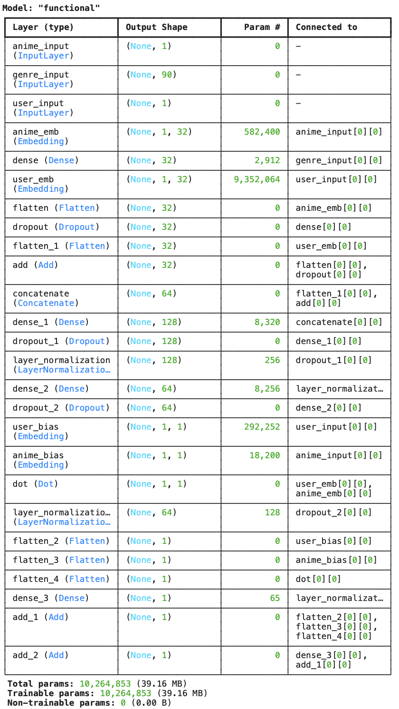
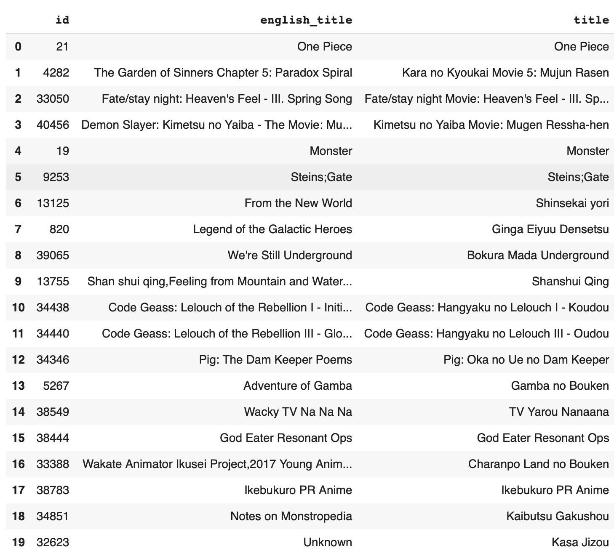

# 🎯 Anime Recommendation System: Embedding Models & Baselines

This folder contains experiments and final solutions for building an anime recommendation system, moving from traditional methods to state-of-the-art neural embedding models.

---

## **Project Overview**

- **Goal:** Predict user anime ratings as accurately as possible, enabling personalized recommendations.
- **Data:** User-anime rating matrix and anime metadata (see previous EDA).
- **Environment:** Embedding models trained in Google Colab on TPU.

---

## **File Structure**

- `baseline_methods.ipynb` — Collaborative filtering (user-user, item-item), WRMF, and other classical approaches.
- `embedding_model_tests.ipynb` — Experiments with different embedding sizes, hybrid structures, and model variants.
- `recommendation_system_final.ipynb` — **Best performing genre-aware neural model and final evaluation.**

---

## **Modeling Approach**

### 1. **Baselines & Traditional Methods**

- Explored:
  - **User-User Collaborative Filtering**
  - **Item-Item Collaborative Filtering**
  - **Weighted Regularized Matrix Factorization (WRMF)**
- **Results:** All classic methods performed poorly on this data (RMSE and MAE much worse than even simple embedding models).

### 2. **Neural Embedding Models**

- Developed deep learning models using user and anime embeddings (with genre-aware features).
- **Model selection:** Tuned embedding sizes, tested hybrid (dot product + MLP) architectures, and included anime genre features for best performance.

---

## **Key Results**

| Model                     | RMSE       | MAE        | R²         | Notes                 |
| ------------------------- | ---------- | ---------- | ---------- | --------------------- |
| Baseline (dim=128)        | 2.8135     | 2.0294     | 0.4819     | Original model        |
| Best Embedding (dim=32)   | 2.7998     | 1.9619     | 0.4870     | Best dot/MLP config   |
| **Genre-aware hybrid ✅** | **2.7927** | **2.0191** | **0.4896** | Best overall model 🎯 |

> The **genre-aware hybrid embedding model** achieved the best results, with **RMSE 2.79**, **MAE 2.02**, and **R² 0.49** on the test set—significantly outperforming all classic collaborative filtering and matrix factorization approaches.

---

## **Model Architecture & Sample Output**

### **Model Structure**

### **Sample Recommendation Output**

---

## **How to Reproduce**

1. Open `recommendation_system_final.ipynb` in Google Colab (TPU runtime).
2. Follow instructions in the notebook to preprocess data, train the model, and evaluate results.

- **Note** Full dataset is not provided due to size. You can always use [`scrapping notebook`](../data/test_scrapping.ipynb) yourself.

---

## **Highlights & Takeaways**

- **Embedding models** (even simple ones) outperformed all classic collaborative filtering and matrix factorization baselines.
- **Adding genre features** and using a hybrid (dot + MLP) architecture led to substantial performance improvements.
- Results suggest deep, content-aware models are far superior to standard methods for anime recommendation tasks with this dataset.

---

## **Contact**

For questions or collaboration, open an issue or contact `xular.13 [at] gmail [dot] com`

---

**Note:**  
All code and results are for educational and research use.
